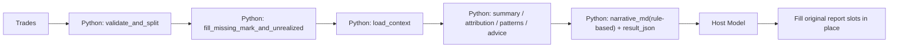

# Trade Review

[简体中文](README.md)

Turn normalized trade records into a complete, auditable trade review package.  
The default architecture is now:

```text
Python handles deterministic computation
The host model fills the original report slots in place
```

The skill no longer assumes that Python should call an external LLM provider by default.

## 1. What this skill does

`trade-review` converts trade records into a structured retrospective package with:

- validation
- mark-price completion for open positions
- market context loading
- summary and attribution
- per-trade quality review
- repeatable mistake pattern detection
- actionable advice
- host-model handoff slots for narrative content

Typical use cases:

- daily review
- range review
- strategy review
- account review
- mistake pattern diagnosis

## 2. Default architecture



### Responsibilities

| Layer | Responsibility |
|---|---|
| Python | deterministic, testable computation |
| Host model | read `result_json` and fill narrative content into the original report structure |

This means:

- the skill still works without external LLM credentials
- the host model must not append a separate “summary-style” closeout
- the host model must fill the original narrative slots in place

## 3. Directory structure

```text
skill-trade-review/
├─ agents/
├─ references/
├─ scripts/
│  ├─ advice.py
│  ├─ asset_classifier.py
│  ├─ context_loader.py
│  ├─ future_context.py
│  ├─ market_review.py
│  ├─ per_trade_review.py
│  ├─ patterns.py
│  ├─ pnl_normalizer.py
│  ├─ review.py
│  ├─ stock_context.py
│  ├─ strategy_doc.py
│  ├─ technical_indicators.py
│  └─ test.py
├─ LICENSE
├─ README.md
├─ README.en.md
├─ requirements.txt
└─ SKILL.md
```

## 4. Input contract

### Required input

`trades: list[dict]`

Trades must already be normalized.  
This skill does not rematch raw fills and does not recompute realized PnL from execution logs.

### Fields

| Field | Type | closed | open | Notes |
|---|---|---|---|---|
| `trade_date` | string | required | required | `YYYY-MM-DD` |
| `trade_time` | string | optional | optional | `HH:MM:SS` |
| `account_id` | string | optional | optional | account or strategy id |
| `ts_code` | string | required | required | instrument code |
| `direction` | string | required | required | `long` / `short` |
| `status` | string | required | required | `closed` / `open` |
| `volume` | float | required | required | size |
| `realized_pnl` | float | required | n/a | realized net pnl |
| `cost_price` | float | optional | required | weighted entry price |
| `mark_price` | float | optional | optional | latest price |
| `unrealized_pnl` | float | optional | optional | floating pnl |
| `open_date` | string | optional | optional | open date |
| `reason_tag` | string | optional | optional | entry tag |

### Validation rules

- `closed` rows must have `realized_pnl`
- `open` rows must have `cost_price`
- `direction` must be `long` or `short`
- `status` must be `closed` or `open`

## 5. Formal market-data path

The default formal path uses `panda_data`.

### Required configuration

```bash
set PANDA_DATA_USERNAME=
set PANDA_DATA_PASSWORD=
```

### Notes

| Item | Behavior |
|---|---|
| Formal data source | `panda_data` |
| Missing credentials | fail fast, no silent downgrade |
| Open-position price fill | can be completed from formal data |
| Market-context extraction | loaded from the formal pipeline by default |

## 6. Output contract

The main entrypoint returns a one-row DataFrame aligned with the production schema.

| Field | Description |
|---|---|
| `trade_date` | review date |
| `build_id` | `R00` |
| `build_name` | `交易复盘` |
| `target_id` | account or strategy id |
| `result_type` | `daily_review` / `range_review` |
| `result_value` | `excellent` / `good` / `neutral` / `poor` / `bad` |
| `result_json` | structured payload |
| `data_version` | data version |
| `update_time` | update timestamp |

### Main `result_json` keys

| Key | Description |
|---|---|
| `period` | review period |
| `summary` | summary metrics |
| `attribution` | attribution |
| `market_review` | market context |
| `trade_reviews` | per-trade review |
| `patterns` | repeatable error patterns |
| `advice` | actionable advice |
| `narrative_md` | rule-based readable report |
| `narrative` | host-filled decision narrative |
| `insights` | host-filled insights |
| `strategy_review` | host-filled strategy-fit section |
| `llm_meta` | host/external llm status |
| `host_handoff` | host handoff marker |
| `host_fill_contract` | host fill contract |

## 7. Host-model fill rules

This is the key change in the current design.

### Not allowed

- do not append a separate “summary” section instead of filling the original LLM slots
- do not change the report structure
- do not move per-trade comments to a separate appendix
- do not rewrite numeric fields

### Required fill locations

| Original report location | What the host model must fill |
|---|---|
| `二、市场行情研判` | market narrative, shape assessment, key-level interpretation, directional triggers |
| `三、逐笔交易点评` | per-trade comments in place |
| `六、综合复盘` | integrated decision narrative and insights |
| `二补充：策略适配复盘` | strategy-fit review and strategy-level advice |

### Contract field

`result_json.host_fill_contract`

This field explicitly tells the host model:

- the report structure must not change
- which original LLM slots must be filled
- that a separate summary-style appendix is not allowed

## 8. Scoring and attribution

### Summary

Includes:

- trade counts
- win rate
- realized / unrealized pnl
- average win / loss
- profit factor
- open exposure

### Attribution

By:

- `by_asset_type`
- `by_status`
- `by_direction`
- `by_variety`
- `by_account`
- `by_reason_tag`

### Patterns

The current rule layer can detect patterns such as:

- direction-concentrated loss
- variety-concentrated loss
- trading against term structure
- risk buildup in open positions
- delayed stop-loss behavior

## 9. Quick start

### Run tests

```bash
python scripts/test.py
```

### Python usage

```python
from scripts.review import run

result = run(
    trades,
    context=None,
    mode="range",
    period={"start": "2026-06-04", "end": "2026-06-10"},
    config={
        "panda_data": {
            "username": "...",
            "password": "...",
        },
        "llm": {
            "enabled": True
        }
    },
)
```

### CLI usage

```bash
python scripts/review.py --trades trades.csv --mode daily
```

## 10. Recommended operating pattern

```text
1. Prepare normalized trades
2. Run review.py to generate result_json
3. Let the host model read result_json
4. Fill the original report slots according to host_fill_contract
5. Produce the final review report
```

## 11. Development and maintenance

### Regression coverage

Current tests cover:

- stock only
- futures only
- mixed
- missing field
- host model mode by default
- mock context
- strategy doc parsing

### Modification rules

- do not recompute realized pnl from raw fills
- do not bypass the formal `panda_data` pipeline for formal reviews
- say `not yet proven` when the cause is not actually proven
- if trade-by-trade evidence is requested, do not replace it with a high-level summary

## 12. References

```text
references/method_guide.md
references/data_guide.md
references/llm_policy.md
references/output_contract.md
references/review_checklist.md
```
