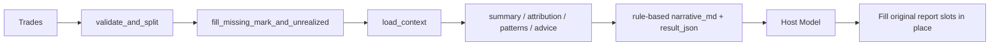

# trade-review

[简体中文](README.md)

`trade-review` converts normalized trade records into a full review package.  
Its goal is not to generate a loose summary paragraph, but to first produce stable structured review data and then let the host model fill the required judgment-heavy sections back into the original report layout.

## 1. What this skill is for

This skill is intended for:

- daily review
- range review
- strategy review
- account-level review
- mistake-pattern diagnosis
- per-trade quality analysis

It produces:

- summary statistics
- direction / variety / tag attribution
- market context
- per-trade review
- repeatable error patterns
- actionable advice
- a host-model fill contract for the original report structure

## 2. Design principles

### 2.1 Python does deterministic work only

The scripts are responsible for:

- validating inputs
- filling mark prices for open positions
- loading formal market data
- computing summary / attribution / patterns / advice
- producing a rule-based `narrative_md`

### 2.2 The host model fills the original report slots

By default, Python does not call an external LLM provider.  
The host model must read `result_json` and fill the required content back into the original report slots.

### 2.3 No “extra summary” workaround

The host model must not:

- append a separate “summary” section instead of filling the original LLM slots
- change the report structure
- move per-trade comments somewhere else
- rewrite any numeric fields

## 3. Default architecture



## 4. Repository structure

```text
skill-trade-review/
├─ agents/
├─ references/
├─ scripts/
│  ├─ advice.py
│  ├─ asset_classifier.py
│  ├─ context_loader.py
│  ├─ future_context.py
│  ├─ market_review.py
│  ├─ patterns.py
│  ├─ per_trade_review.py
│  ├─ pnl_normalizer.py
│  ├─ review.py
│  ├─ stock_context.py
│  ├─ strategy_doc.py
│  ├─ technical_indicators.py
│  └─ test.py
├─ LICENSE
├─ README.md
├─ README.en.md
├─ requirements.txt
└─ SKILL.md
```

## 5. Input contract

### 5.1 Required input

`trades: list[dict]`

Trades must already be normalized.  
This skill does not rematch raw fills and does not recompute realized PnL from execution logs.

### 5.2 Field definitions

| Field | Type | closed | open | Notes |
|---|---|---|---|---|
| `trade_date` | string | required | required | `YYYY-MM-DD` |
| `trade_time` | string | optional | optional | `HH:MM:SS` |
| `account_id` | string | optional | optional | account or strategy id |
| `ts_code` | string | required | required | instrument code |
| `direction` | string | required | required | `long` / `short` |
| `status` | string | required | required | `closed` / `open` |
| `volume` | float | required | required | size |
| `realized_pnl` | float | required | n/a | realized net pnl |
| `cost_price` | float | optional | required | weighted entry price |
| `mark_price` | float | optional | optional | latest price |
| `unrealized_pnl` | float | optional | optional | floating pnl |
| `open_date` | string | optional | optional | open date |
| `reason_tag` | string | optional | optional | entry tag |

### 5.3 Validation rules

- `closed` rows must include `realized_pnl`
- `open` rows must include `cost_price`
- `direction` must be `long` or `short`
- `status` must be `closed` or `open`

## 6. Formal market-data path

The default formal path uses `panda_data`.

### Required configuration

```bash
set PANDA_DATA_USERNAME=
set PANDA_DATA_PASSWORD=
```

### Notes

| Item | Behavior |
|---|---|
| Formal data source | `panda_data` |
| Missing credentials | fail fast |
| Open-position mark fill | supported |
| Market context extraction | loaded from the formal data path by default |

## 7. Output contract

The main entrypoint returns a one-row DataFrame.

| Field | Description |
|---|---|
| `trade_date` | review date |
| `build_id` | `R00` |
| `build_name` | `交易复盘` |
| `target_id` | account or strategy id |
| `result_type` | `daily_review` / `range_review` |
| `result_value` | `excellent` / `good` / `neutral` / `poor` / `bad` |
| `result_json` | structured review payload |
| `data_version` | data version |
| `update_time` | update timestamp |

### 7.1 Top-level `result_json` keys

| Key | Description |
|---|---|
| `period` | review period |
| `summary` | summary metrics |
| `attribution` | attribution |
| `market_review` | market context |
| `trade_reviews` | per-trade review |
| `patterns` | repeatable error patterns |
| `advice` | actionable advice |
| `narrative_md` | full rule-based markdown report |
| `narrative` | host-filled integrated review narrative |
| `insights` | host-filled insights |
| `strategy_review` | host-filled strategy-fit section |
| `llm_meta` | LLM / host handoff status |
| `host_handoff` | host handoff metadata |
| `host_fill_contract` | host fill contract |

## 8. Host-model fill rules

This is the most important part of the current design.

### 8.1 Required original locations

| Original report location | What the host model must provide |
|---|---|
| `二、市场行情研判` | market narrative, shape assessment, key-level interpretation, directional triggers |
| `三、逐笔交易点评` | per-trade comments in place |
| `六、综合复盘` | integrated narrative, key mistakes, next actions |
| `二补充：策略适配复盘` | strategy-fit judgment, observations, strategy-level advice |

### 8.2 Forbidden behavior

- do not replace these sections with a separate summary
- do not change the report structure
- do not skip per-trade comments
- do not rewrite numeric fields

### 8.3 Contract field

`result_json.host_fill_contract`

This field explicitly declares:

- the report structure must not change
- which original slots must be filled
- that the host model must fill them in place
- that a standalone summary-style add-on is not allowed

## 9. Core computed outputs

### 9.1 Summary

Includes:

- trade counts
- win rate
- realized / unrealized pnl
- average win / average loss
- profit factor
- open exposure

### 9.2 Attribution

By:

- `by_asset_type`
- `by_status`
- `by_direction`
- `by_variety`
- `by_account`
- `by_reason_tag`

### 9.3 Patterns

The current rule layer can detect patterns such as:

- direction-concentrated loss
- variety-concentrated loss
- trading against term structure
- risk buildup
- delayed stop-loss behavior

## 10. Quick start

### 10.1 Run tests

```bash
python scripts/test.py
```

### 10.2 Python usage

```python
from scripts.review import run

result = run(
    trades,
    context=None,
    mode="range",
    period={"start": "2026-06-04", "end": "2026-06-10"},
    config={
        "panda_data": {
            "username": "...",
            "password": "...",
        },
        "llm": {
            "enabled": True
        }
    },
)
```

### 10.3 CLI usage

```bash
python scripts/review.py --trades trades.csv --mode daily
```

## 11. Recommended operating pattern

```text
1. Prepare normalized trades
2. Run review.py to generate result_json
3. Let the host model read result_json
4. Fill the original report slots according to host_fill_contract
5. Produce the final review report
```

## 12. Development and maintenance

### 12.1 Regression coverage

Current tests cover:

- stock only
- futures only
- mixed
- missing field
- host model mode by default
- mock context
- strategy doc parsing

### 12.2 Modification rules

- do not recompute realized pnl from raw fills
- do not bypass `panda_data` for formal review
- say `not yet proven` when the cause is not actually proven
- if trade-by-trade evidence is requested, do not replace it with a high-level summary

## 13. References

```text
references/method_guide.md
references/data_guide.md
references/llm_policy.md
references/output_contract.md
references/review_checklist.md
```
