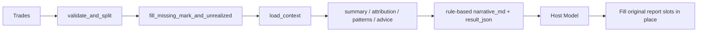

# trade-review

[English](README.en.md)

`trade-review` 是一个把交易明细转换成完整复盘结果的技能。  
它的核心目标不是“生成一段总结”，而是先稳定产出结构化复盘数据，再由宿主模型按原报告结构把需要主观判断的位置逐项回填。

## 1. 能解决什么问题

这个技能面向以下场景：

- 日度复盘
- 区间复盘
- 策略复盘
- 账户级复盘
- 错误模式分析
- 逐笔交易质量评价

它能把一份已经归并好的交易记录，转换为：

- 交易汇总统计
- 方向 / 品种 / 标签归因
- 市场环境判断
- 逐笔交易评价
- 错误模式识别
- 可执行建议
- 原报告结构对应的宿主模型回填契约

## 2. 设计原则

### 2.1 Python 只做确定性计算

脚本负责：

- 校验输入
- 补齐未平仓价格
- 拉取正式行情
- 计算 summary / attribution / patterns / advice
- 产出规则版 `narrative_md`

### 2.2 宿主模型负责原位回填

默认不在 Python 内部单独调用外部 LLM。  
宿主模型必须读取 `result_json`，并把回答填回原报告的固定位置。

### 2.3 不允许把原结构改成“额外总结”

宿主模型不允许：

- 另起一段“总结式结尾”代替原有 LLM 插槽
- 改动报告章节结构
- 把逐笔点评移动到别处
- 改写任何数值字段

## 3. 当前默认架构



## 4. 目录结构

```text
skill-trade-review/
├─ agents/
├─ references/
├─ scripts/
│  ├─ advice.py
│  ├─ asset_classifier.py
│  ├─ context_loader.py
│  ├─ future_context.py
│  ├─ market_review.py
│  ├─ patterns.py
│  ├─ per_trade_review.py
│  ├─ pnl_normalizer.py
│  ├─ review.py
│  ├─ stock_context.py
│  ├─ strategy_doc.py
│  ├─ technical_indicators.py
│  └─ test.py
├─ LICENSE
├─ README.md
├─ README.en.md
├─ requirements.txt
└─ SKILL.md
```

## 5. 输入契约

### 5.1 必需输入

`trades: list[dict]`

交易记录必须已经归并完成。  
本技能不负责从逐笔成交重新匹配 FIFO，也不负责重算已实现 PnL。

### 5.2 字段定义

| 字段 | 类型 | closed | open | 说明 |
|---|---|---|---|---|
| `trade_date` | string | required | required | `YYYY-MM-DD` |
| `trade_time` | string | optional | optional | `HH:MM:SS` |
| `account_id` | string | optional | optional | 账户或策略 ID |
| `ts_code` | string | required | required | 标的代码 |
| `direction` | string | required | required | `long` / `short` |
| `status` | string | required | required | `closed` / `open` |
| `volume` | float | required | required | 数量 |
| `realized_pnl` | float | required | n/a | 已实现净收益 |
| `cost_price` | float | optional | required | 加权开仓成本 |
| `mark_price` | float | optional | optional | 当前价格 |
| `unrealized_pnl` | float | optional | optional | 浮盈亏 |
| `open_date` | string | optional | optional | 开仓日期 |
| `reason_tag` | string | optional | optional | 入场标签 |

### 5.3 校验规则

- `closed` 行必须有 `realized_pnl`
- `open` 行必须有 `cost_price`
- `direction` 只能是 `long` 或 `short`
- `status` 只能是 `closed` 或 `open`

## 6. 正式行情链路

默认正式链路使用 `panda_data`。

### 必需配置

```bash
set PANDA_DATA_USERNAME=
set PANDA_DATA_PASSWORD=
```

### 行为说明

| 项 | 行为 |
|---|---|
| 正式行情来源 | `panda_data` |
| 缺少凭据 | 立即中止 |
| 未平仓补价 | 可自动补齐 |
| 市场环境提取 | 默认走正式链路 |

## 7. 输出契约

主入口返回一行 DataFrame。

| 字段 | 说明 |
|---|---|
| `trade_date` | 复盘日期 |
| `build_id` | `R00` |
| `build_name` | `交易复盘` |
| `target_id` | 账户或策略 ID |
| `result_type` | `daily_review` / `range_review` |
| `result_value` | `excellent` / `good` / `neutral` / `poor` / `bad` |
| `result_json` | 结构化复盘主体 |
| `data_version` | 数据版本 |
| `update_time` | 更新时间 |

### 7.1 `result_json` 顶层字段

| 字段 | 说明 |
|---|---|
| `period` | 复盘区间 |
| `summary` | 汇总指标 |
| `attribution` | 归因 |
| `market_review` | 市场环境 |
| `trade_reviews` | 逐笔评价 |
| `patterns` | 错误模式 |
| `advice` | 建议 |
| `narrative_md` | 规则版完整报告 |
| `narrative` | 宿主模型回填的综合复盘段 |
| `insights` | 宿主模型回填的洞察 |
| `strategy_review` | 宿主模型回填的策略适配段 |
| `llm_meta` | LLM / 宿主接管状态 |
| `host_handoff` | 宿主接管说明 |
| `host_fill_contract` | 宿主必须遵守的回填契约 |

## 8. 宿主模型回填规则

这是当前版本最关键的部分。

### 8.1 必须回填的原位置

| 原位置 | 宿主模型必须产出 |
|---|---|
| `二、市场行情研判` | 市场叙事、形态判断、关键位解释、方向触发条件 |
| `三、逐笔交易点评` | 每笔交易的针对性点评 |
| `六、综合复盘` | 综合叙事、关键失误、下一步行动 |
| `二补充：策略适配复盘` | 策略适配判断、关键观察、策略级建议 |

### 8.2 禁止行为

- 不允许把这些内容挪到报告末尾单独写“总结”
- 不允许改章节结构
- 不允许跳过逐笔点评，只给高层结论
- 不允许改写数值字段

### 8.3 契约字段

`result_json.host_fill_contract`

该字段会明确声明：

- 报告结构不可变
- 哪些原插槽必须回填
- 宿主模型必须原位回填
- 不允许追加独立总结式段落

## 9. 核心计算结果

### 9.1 summary

包括：

- 交易笔数
- 胜率
- 已实现 / 未实现 PnL
- 平均盈利 / 平均亏损
- profit factor
- open exposure

### 9.2 attribution

维度包括：

- `by_asset_type`
- `by_status`
- `by_direction`
- `by_variety`
- `by_account`
- `by_reason_tag`

### 9.3 patterns

当前规则层可识别多类错误模式，例如：

- 方向集中亏损
- 品种集中亏损
- 逆期限结构交易
- 风险累积
- 止损拖延

## 10. 快速开始

### 10.1 跑测试

```bash
python scripts/test.py
```

### 10.2 Python 调用

```python
from scripts.review import run

result = run(
    trades,
    context=None,
    mode="range",
    period={"start": "2026-06-04", "end": "2026-06-10"},
    config={
        "panda_data": {
            "username": "...",
            "password": "...",
        },
        "llm": {
            "enabled": True
        }
    },
)
```

### 10.3 CLI 调用

```bash
python scripts/review.py --trades trades.csv --mode daily
```

## 11. 推荐使用模式

```text
1. 准备标准化 trades
2. 用 review.py 生成 result_json
3. 让宿主模型读取 result_json
4. 按 host_fill_contract 回填原报告位置
5. 输出最终复盘报告
```

## 12. 开发与维护

### 12.1 回归覆盖

当前测试覆盖：

- stock only
- futures only
- mixed
- missing field
- host model mode by default
- mock context
- strategy doc parsing

### 12.2 修改原则

- 不要从原始成交重算 realized PnL
- 正式复盘不要绕开 `panda_data`
- 根因未证实时必须写 `not yet proven`
- 用户要求逐笔证据时不能偷换成高层概述

## 13. 参考文档

```text
references/method_guide.md
references/data_guide.md
references/llm_policy.md
references/output_contract.md
references/review_checklist.md
```
