# Trade Review

## Purpose

Turn normalized trade records into a complete trade-review package:

1. Validate and normalize closed/open trades.
2. Pull stock or futures market context when needed.
3. Compute summary and attribution.
4. Review market regime and per-trade quality.
5. Detect repeatable error patterns.
6. Generate advice and optional LLM narrative.

This skill is self-contained for trade review generation. It does not recompute FIFO matching. Realized PnL is trusted from the caller.

## Input Contract

### Required input

`trades: list[dict]`

The caller must pass already-normalized trade rows. The skill accepts both closed and open rows.

| Field | Type | Description | closed | open |
|---|---|---|---|---|
| `trade_date` | string | `YYYY-MM-DD` | required | required |
| `trade_time` | string | `HH:MM:SS` | optional | optional |
| `account_id` | string | account or strategy id | optional | optional |
| `ts_code` | string | instrument code | required | required |
| `direction` | string | `long` or `short` | required | required |
| `status` | string | `closed` or `open` | required | required |
| `volume` | float | size | required | required |
| `realized_pnl` | float | net realized pnl | required | n/a |
| `cost_price` | float | weighted entry price | optional | required |
| `mark_price` | float | latest mark price | optional | optional |
| `unrealized_pnl` | float | floating pnl | optional | optional |
| `open_date` | string | open date | optional | optional |
| `reason_tag` | string | entry reason tag | optional | optional |

### Validation rules

- Closed rows must have `realized_pnl`.
- Open rows must have `cost_price` and `volume`.
- `direction` must be `long` or `short`.
- `status` must be `closed` or `open`.
- If an open row misses `mark_price`, the skill may fetch it from the official context pipeline.

## Output Contract

Return a one-row DataFrame aligned with the production review shape.

| Field | Type | Description |
|---|---|---|
| `trade_date` | string | review date |
| `build_id` | string | `R00` |
| `build_name` | string | `交易复盘` |
| `target_id` | string | account id or `default` |
| `result_type` | string | `daily_review` or `range_review` |
| `result_value` | string | `excellent` / `good` / `neutral` / `poor` / `bad` |
| `result_json` | string | structured review payload |
| `data_version` | string | `real-v1` |
| `update_time` | string | ISO timestamp |

### `result_json` top-level keys

- `period`
- `summary`
- `attribution`
- `market_review`
- `trade_reviews`
- `patterns`
- `advice`
- `narrative_md`
- `narrative`
- `insights`
- `warnings`
- `llm_meta`

## LLM Rules

- LLM enhancement is optional. The skill must still produce a complete rule-based review when no external LLM client is configured.
- Prefer the host AI or current session model when the runtime supports direct model use; only use external provider credentials as an optional fallback.
- LLM never rewrites numeric fields such as summary, attribution, patterns, advice, score, or rating.
- LLM only reads desensitized aggregates and review summaries, not raw order-level sensitive fields.
- If schema validation fails, the LLM section must degrade safely instead of silently corrupting output.
- Audit logs and cache files are written under the user skill cache directory when the external LLM path is used.

See [references/llm_policy.md](references/llm_policy.md).

## Workflow

```mermaid
flowchart LR
    A["Trades"] --> B["validate_and_split"]
    B --> C["fill_missing_mark_and_unrealized"]
    C --> D["load_context"]
    D --> E["compute_summary_and_attribution"]
    E --> F["build_market_review"]
    F --> G["review_all_trades"]
    G --> H["detect_patterns"]
    H --> I["generate_advice"]
    I --> J["result_json"]
```



## Scripts

| Script | Purpose |
|---|---|
| `scripts/review.py` | main entrypoint |
| `scripts/test.py` | local regression tests |
| `scripts/pnl_normalizer.py` | validation and mark/unrealized normalization |
| `scripts/context_loader.py` | official context loading |
| `scripts/market_review.py` | market regime review |
| `scripts/per_trade_review.py` | per-trade review |
| `scripts/patterns.py` | rule-based pattern detection |
| `scripts/advice.py` | advice mapping |

## Run

```python
from scripts.review import run

result = run(
    trades,
    context=None,
    mode="daily",
    period={"start": "2026-06-04", "end": "2026-06-04"},
    config={"benchmark": "auto", "llm": {"enabled": True}},
)
```

Default behavior:

- `run()` computes the full rule-based review package locally.
- The host AI should read `result_json` and fill the original LLM answer slots in place.
- The report structure must not change.
- The host AI must not append a separate summary-style closeout in place of the original LLM sections.
- The host AI should fill these original locations:

| Original location | What the host AI must produce |
|---|---|
| `二、市场行情研判` | market narrative, key levels commentary, directional triggers |
| `三、逐笔交易点评` | per-trade comments in place |
| `六、综合复盘` | decision narrative and insights |
| `二补充：策略适配复盘` | strategy fit analysis and decision advice |

- External provider calls are optional and should be enabled explicitly, not assumed by default.

```bash
python scripts/review.py --trades trades.csv --mode daily --date 2026-06-04
```

## Required Checks

Before delivery, run:

```bash
python scripts/test.py
```

The core test set should cover:

- stock only
- futures only
- mixed assets
- short positions
- missing fields and warning behavior
- LLM disabled mode

## Guardrails

- Do not recompute realized PnL from raw fills.
- Do not bypass the official market-context pipeline in formal use.
- If the root cause of a behavior difference is not proven, say `not yet proven`.
- If trade-by-trade comparison is requested, keep per-trade evidence.

## References

- [references/method_guide.md](references/method_guide.md)
- [references/data_guide.md](references/data_guide.md)
- [references/llm_policy.md](references/llm_policy.md)
- [references/output_contract.md](references/output_contract.md)
- [references/review_checklist.md](references/review_checklist.md)
